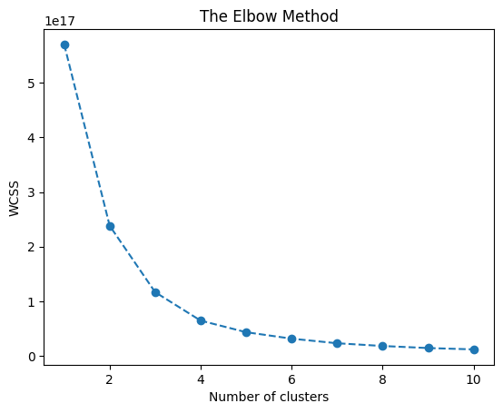
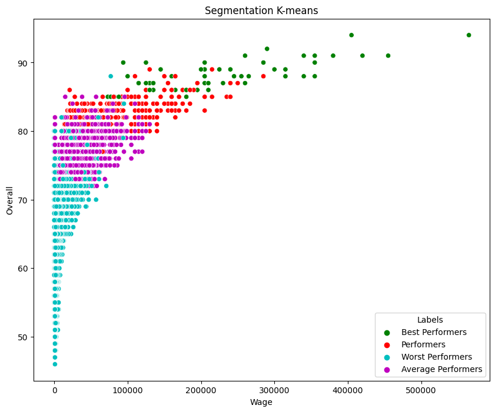
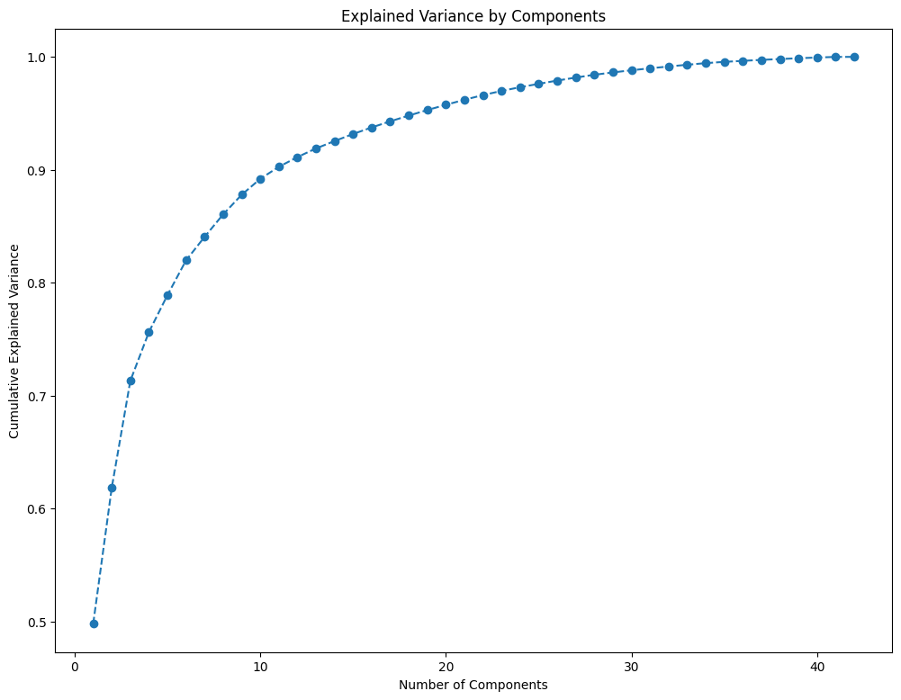
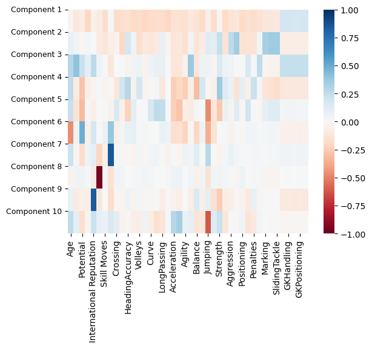
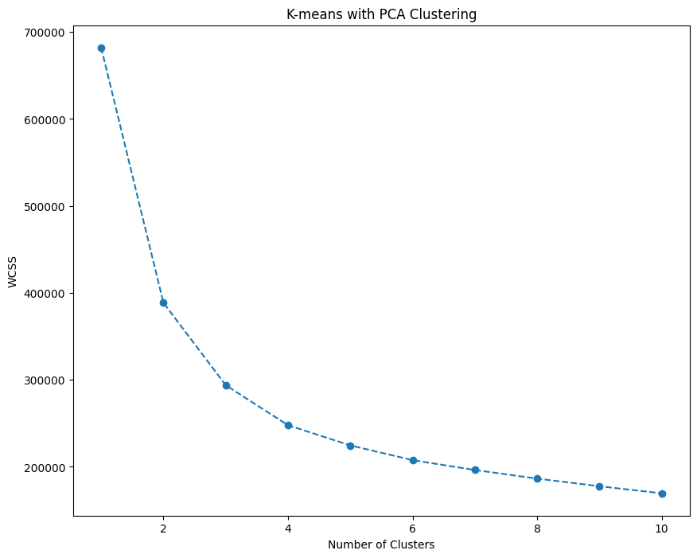
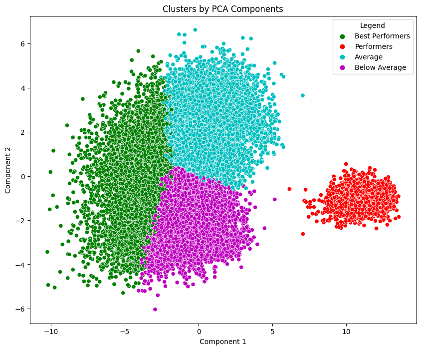
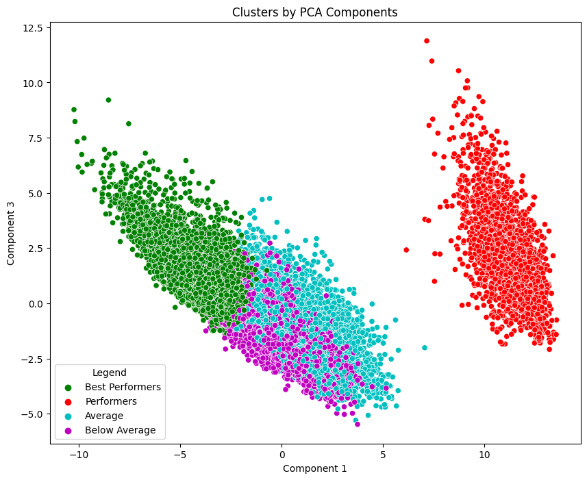

# Understanding Data Clustering with K-Means and PCA

Data analysis is an essential part of decision-making processes in various industries. Clustering, a form of unsupervised machine learning, plays a vital role in segmenting data into meaningful groups. In this article, we will explore the use of K-Means clustering and Principal Component Analysis (PCA) to gain insights from a dataset containing FIFA player statistics.

## Getting Started

Before we dive into clustering, we need to prepare our environment by importing the necessary Python libraries and loading the dataset. For this tutorial, we'll be using the FIFA player dataset. Here's how we set things up:


```python
import pandas as pd
import numpy as np
import matplotlib.pyplot as plt
import seaborn as sns
```


```python
fifa_data = pd.read_csv('./FIFA.csv')
```

## Data Preprocessing

### Handling Missing Values
Data preprocessing is crucial to ensure the accuracy of our analysis. We start by checking for missing values in our dataset:


```python
cluster_data["Club"] = cluster_data["Club"].fillna("No Club")
cluster_data.isna().sum()
```

    C:\Users\HP\AppData\Local\Programs\Python\Python37\lib\site-packages\ipykernel_launcher.py:1: SettingWithCopyWarning: 
    A value is trying to be set on a copy of a slice from a DataFrame.
    Try using .loc[row_indexer,col_indexer] = value instead
    
    See the caveats in the documentation: https://pandas.pydata.org/pandas-docs/stable/user_guide/indexing.html#returning-a-view-versus-a-copy
      """Entry point for launching an IPython kernel.
    


    Age            0
    Nationality    0
    Overall        0
    Club           0
    Value          0
    Wage           0
    dtype: int64


We also need to fix the Value and Wage columns by converting them to numerical values:

### Fix `Value` and `Wage` Columns


```python
# Function to convert the `Value` and `Wage` to be numerical
def convert_value(value):
    # Remove Euro symbol and leading/trailing whitespace
    value = value.replace('€', '').strip()
    
    # Check if the value ends with 'M'
    if value.endswith('M'):
        # Convert 'M' to six zeros
        value = float(value.replace('M', '')) * 1e6
    elif value.endswith('K'):
        # Convert 'K' to three zeros
        value = float(value.replace('K', '')) * 1e3
    
    return value

# Apply the conversion function to the 'Value' column
cluster_data['Value'] = cluster_data['Value'].apply(convert_value)

cluster_data["Wage"] = cluster_data["Wage"].apply(convert_value)
cluster_data
```

    C:\Users\HP\AppData\Local\Programs\Python\Python37\lib\site-packages\ipykernel_launcher.py:17: SettingWithCopyWarning: 
    A value is trying to be set on a copy of a slice from a DataFrame.
    Try using .loc[row_indexer,col_indexer] = value instead
    
    See the caveats in the documentation: https://pandas.pydata.org/pandas-docs/stable/user_guide/indexing.html#returning-a-view-versus-a-copy
      app.launch_new_instance()
    C:\Users\HP\AppData\Local\Programs\Python\Python37\lib\site-packages\ipykernel_launcher.py:19: SettingWithCopyWarning: 
    A value is trying to be set on a copy of a slice from a DataFrame.
    Try using .loc[row_indexer,col_indexer] = value instead
    
    See the caveats in the documentation: https://pandas.pydata.org/pandas-docs/stable/user_guide/indexing.html#returning-a-view-versus-a-copy
    


<div>
<style scoped>
    .dataframe tbody tr th:only-of-type {
        vertical-align: middle;
    }

    .dataframe tbody tr th {
        vertical-align: top;
    }

    .dataframe thead th {
        text-align: right;
    }
</style>
<table border="1" class="dataframe">
  <thead>
    <tr style="text-align: right;">
      <th></th>
      <th>Age</th>
      <th>Nationality</th>
      <th>Overall</th>
      <th>Club</th>
      <th>Value</th>
      <th>Wage</th>
    </tr>
  </thead>
  <tbody>
    <tr>
      <th>0</th>
      <td>31</td>
      <td>Argentina</td>
      <td>94</td>
      <td>FC Barcelona</td>
      <td>110500000.0</td>
      <td>565000.0</td>
    </tr>
    <tr>
      <th>1</th>
      <td>33</td>
      <td>Portugal</td>
      <td>94</td>
      <td>Juventus</td>
      <td>77000000.0</td>
      <td>405000.0</td>
    </tr>
    <tr>
      <th>2</th>
      <td>26</td>
      <td>Brazil</td>
      <td>92</td>
      <td>Paris Saint-Germain</td>
      <td>118500000.0</td>
      <td>290000.0</td>
    </tr>
    <tr>
      <th>3</th>
      <td>27</td>
      <td>Spain</td>
      <td>91</td>
      <td>Manchester United</td>
      <td>72000000.0</td>
      <td>260000.0</td>
    </tr>
    <tr>
      <th>4</th>
      <td>27</td>
      <td>Belgium</td>
      <td>91</td>
      <td>Manchester City</td>
      <td>102000000.0</td>
      <td>355000.0</td>
    </tr>
    <tr>
      <th>...</th>
      <td>...</td>
      <td>...</td>
      <td>...</td>
      <td>...</td>
      <td>...</td>
      <td>...</td>
    </tr>
    <tr>
      <th>18202</th>
      <td>19</td>
      <td>England</td>
      <td>47</td>
      <td>Crewe Alexandra</td>
      <td>60000.0</td>
      <td>1000.0</td>
    </tr>
    <tr>
      <th>18203</th>
      <td>19</td>
      <td>Sweden</td>
      <td>47</td>
      <td>Trelleborgs FF</td>
      <td>60000.0</td>
      <td>1000.0</td>
    </tr>
    <tr>
      <th>18204</th>
      <td>16</td>
      <td>England</td>
      <td>47</td>
      <td>Cambridge United</td>
      <td>60000.0</td>
      <td>1000.0</td>
    </tr>
    <tr>
      <th>18205</th>
      <td>17</td>
      <td>England</td>
      <td>47</td>
      <td>Tranmere Rovers</td>
      <td>60000.0</td>
      <td>1000.0</td>
    </tr>
    <tr>
      <th>18206</th>
      <td>16</td>
      <td>England</td>
      <td>46</td>
      <td>Tranmere Rovers</td>
      <td>60000.0</td>
      <td>1000.0</td>
    </tr>
  </tbody>
</table>
<p>18207 rows × 6 columns</p>
</div>


We turn the wage and value columns to integers.


```python
cluster_data["Value"] = cluster_data["Value"].astype('int')
cluster_data["Wage"] = cluster_data["Wage"].astype('int')
```

    C:\Users\HP\AppData\Local\Programs\Python\Python37\lib\site-packages\ipykernel_launcher.py:1: SettingWithCopyWarning: 
    A value is trying to be set on a copy of a slice from a DataFrame.
    Try using .loc[row_indexer,col_indexer] = value instead
    
    See the caveats in the documentation: https://pandas.pydata.org/pandas-docs/stable/user_guide/indexing.html#returning-a-view-versus-a-copy
      """Entry point for launching an IPython kernel.
    C:\Users\HP\AppData\Local\Programs\Python\Python37\lib\site-packages\ipykernel_launcher.py:2: SettingWithCopyWarning: 
    A value is trying to be set on a copy of a slice from a DataFrame.
    Try using .loc[row_indexer,col_indexer] = value instead
    
    See the caveats in the documentation: https://pandas.pydata.org/pandas-docs/stable/user_guide/indexing.html#returning-a-view-versus-a-copy
      
    


```python
cluster_data.info()
```

    <class 'pandas.core.frame.DataFrame'>
    RangeIndex: 18207 entries, 0 to 18206
    Data columns (total 6 columns):
     #   Column       Non-Null Count  Dtype 
    ---  ------       --------------  ----- 
     0   Age          18207 non-null  int64 
     1   Nationality  18207 non-null  object
     2   Overall      18207 non-null  int64 
     3   Club         18207 non-null  object
     4   Value        18207 non-null  int32 
     5   Wage         18207 non-null  int32 
    dtypes: int32(2), int64(2), object(2)
    memory usage: 711.3+ KB
    

### Encoding Categorical Data
Next, we encode categorical data using one-hot encoding:


```python
# Encode the data
from sklearn.preprocessing import OneHotEncoder, LabelEncoder, StandardScaler
from sklearn.compose import ColumnTransformer

ct = ColumnTransformer(transformers=[('encoder', OneHotEncoder(), [1,3])], remainder='passthrough')
X = ct.fit_transform(cluster_data)
print(X)
```

      (0, 6)	1.0
      (0, 376)	1.0
      (0, 816)	31.0
      (0, 817)	94.0
      (0, 818)	110500000.0
      (0, 819)	565000.0
      (1, 123)	1.0
      (1, 490)	1.0
      (1, 816)	33.0
      (1, 817)	94.0
      (1, 818)	77000000.0
      (1, 819)	405000.0
      (2, 20)	1.0
      (2, 600)	1.0
      (2, 816)	26.0
      (2, 817)	92.0
      (2, 818)	118500000.0
      (2, 819)	290000.0
      (3, 139)	1.0
      (3, 539)	1.0
      (3, 816)	27.0
      (3, 817)	91.0
      (3, 818)	72000000.0
      (3, 819)	260000.0
      (4, 13)	1.0
      :	:
      (18202, 819)	1000.0
      (18203, 144)	1.0
      (18203, 752)	1.0
      (18203, 816)	19.0
      (18203, 817)	47.0
      (18203, 818)	60000.0
      (18203, 819)	1000.0
      (18204, 46)	1.0
      (18204, 286)	1.0
      (18204, 816)	16.0
      (18204, 817)	47.0
      (18204, 818)	60000.0
      (18204, 819)	1000.0
      (18205, 46)	1.0
      (18205, 751)	1.0
      (18205, 816)	17.0
      (18205, 817)	47.0
      (18205, 818)	60000.0
      (18205, 819)	1000.0
      (18206, 46)	1.0
      (18206, 751)	1.0
      (18206, 816)	16.0
      (18206, 817)	46.0
      (18206, 818)	60000.0
      (18206, 819)	1000.0
    

## Determining the Optimal Number of Clusters
Before applying K-Means clustering, we need to determine the optimal number of clusters. We can do this using the Elbow Method:


```python
from sklearn.cluster import KMeans
wcss = []
for i in range(1, 11):
    kmeans = KMeans(n_clusters = i, init = 'k-means++', random_state = 42)
    kmeans.fit(X)
    wcss.append(kmeans.inertia_)
plt.plot(range(1, 11), wcss, marker = 'o', linestyle = '--')
plt.title('The Elbow Method')
plt.xlabel('Number of clusters')
plt.ylabel('WCSS')
plt.show()
```


    

    


## K-Means Clustering
With the optimal number of clusters identified (in this case, let's say 4), we can now perform K-Means clustering:


```python
kmeans = KMeans(n_clusters = 4, init = 'k-means++', random_state = 42)
y_kmeans = kmeans.fit_predict(X)
```

## Analyzing the Clusters
Let's take a closer look at our clusters and analyze the results:


```python
kmeans.labels_
```


    array([2, 2, 2, ..., 1, 1, 1])


```python
df_cluster = cluster_data.copy()

df_cluster["K-means"] = kmeans.labels_
```


```python
df_cluster_analysis = df_cluster.groupby(["K-means"]).mean()
df_cluster_analysis
```


<div>
<style scoped>
    .dataframe tbody tr th:only-of-type {
        vertical-align: middle;
    }

    .dataframe tbody tr th {
        vertical-align: top;
    }

    .dataframe thead th {
        text-align: right;
    }
</style>
<table border="1" class="dataframe">
  <thead>
    <tr style="text-align: right;">
      <th></th>
      <th>Age</th>
      <th>Overall</th>
      <th>Value</th>
      <th>Wage</th>
    </tr>
    <tr>
      <th>K-means</th>
      <th></th>
      <th></th>
      <th></th>
      <th></th>
    </tr>
  </thead>
  <tbody>
    <tr>
      <th>0</th>
      <td>26.057471</td>
      <td>75.959291</td>
      <td>8.282807e+06</td>
      <td>28850.574713</td>
    </tr>
    <tr>
      <th>1</th>
      <td>24.973728</td>
      <td>64.516539</td>
      <td>9.071590e+05</td>
      <td>4809.478372</td>
    </tr>
    <tr>
      <th>2</th>
      <td>26.873016</td>
      <td>87.984127</td>
      <td>6.223016e+07</td>
      <td>222793.650794</td>
    </tr>
    <tr>
      <th>3</th>
      <td>25.928571</td>
      <td>82.327381</td>
      <td>2.504762e+07</td>
      <td>81241.071429</td>
    </tr>
  </tbody>
</table>
</div>


We also calculate the size and proportions of the clusters:


```python
# Compute the size and proportions of the four clusters
df_cluster_analysis['N Obs'] = df_cluster[['K-means','Nationality']].groupby(['K-means']).count()
df_cluster_analysis['Prop Obs'] = df_cluster_analysis['N Obs'] / df_cluster_analysis['N Obs'].sum()
```


```python
df_cluster_analysis
```


<div>
<style scoped>
    .dataframe tbody tr th:only-of-type {
        vertical-align: middle;
    }

    .dataframe tbody tr th {
        vertical-align: top;
    }

    .dataframe thead th {
        text-align: right;
    }
</style>
<table border="1" class="dataframe">
  <thead>
    <tr style="text-align: right;">
      <th></th>
      <th>Age</th>
      <th>Overall</th>
      <th>Value</th>
      <th>Wage</th>
      <th>N Obs</th>
      <th>Prop Obs</th>
    </tr>
    <tr>
      <th>K-means</th>
      <th></th>
      <th></th>
      <th></th>
      <th></th>
      <th></th>
      <th></th>
    </tr>
  </thead>
  <tbody>
    <tr>
      <th>0</th>
      <td>26.057471</td>
      <td>75.959291</td>
      <td>8.282807e+06</td>
      <td>28850.574713</td>
      <td>2088</td>
      <td>0.114681</td>
    </tr>
    <tr>
      <th>1</th>
      <td>24.973728</td>
      <td>64.516539</td>
      <td>9.071590e+05</td>
      <td>4809.478372</td>
      <td>15720</td>
      <td>0.863404</td>
    </tr>
    <tr>
      <th>2</th>
      <td>26.873016</td>
      <td>87.984127</td>
      <td>6.223016e+07</td>
      <td>222793.650794</td>
      <td>63</td>
      <td>0.003460</td>
    </tr>
    <tr>
      <th>3</th>
      <td>25.928571</td>
      <td>82.327381</td>
      <td>2.504762e+07</td>
      <td>81241.071429</td>
      <td>336</td>
      <td>0.018454</td>
    </tr>
  </tbody>
</table>
</div>


```python
df_cluster_analysis.rename({0:'Average Performers',
                            1:'Worst Performers',
                            2:'Best Performers',
                            3:'Performers'})
```


<div>
<style scoped>
    .dataframe tbody tr th:only-of-type {
        vertical-align: middle;
    }

    .dataframe tbody tr th {
        vertical-align: top;
    }

    .dataframe thead th {
        text-align: right;
    }
</style>
<table border="1" class="dataframe">
  <thead>
    <tr style="text-align: right;">
      <th></th>
      <th>Age</th>
      <th>Overall</th>
      <th>Value</th>
      <th>Wage</th>
      <th>N Obs</th>
      <th>Prop Obs</th>
    </tr>
    <tr>
      <th>K-means</th>
      <th></th>
      <th></th>
      <th></th>
      <th></th>
      <th></th>
      <th></th>
    </tr>
  </thead>
  <tbody>
    <tr>
      <th>Average Performers</th>
      <td>26.057471</td>
      <td>75.959291</td>
      <td>8.282807e+06</td>
      <td>28850.574713</td>
      <td>2088</td>
      <td>0.114681</td>
    </tr>
    <tr>
      <th>Worst Performers</th>
      <td>24.973728</td>
      <td>64.516539</td>
      <td>9.071590e+05</td>
      <td>4809.478372</td>
      <td>15720</td>
      <td>0.863404</td>
    </tr>
    <tr>
      <th>Best Performers</th>
      <td>26.873016</td>
      <td>87.984127</td>
      <td>6.223016e+07</td>
      <td>222793.650794</td>
      <td>63</td>
      <td>0.003460</td>
    </tr>
    <tr>
      <th>Performers</th>
      <td>25.928571</td>
      <td>82.327381</td>
      <td>2.504762e+07</td>
      <td>81241.071429</td>
      <td>336</td>
      <td>0.018454</td>
    </tr>
  </tbody>
</table>
</div>


```python
# Add the segment labels to our table
df_cluster['Labels'] = df_cluster['K-means'].map({0:'Average Performers',
                                                  1:'Worst Performers',
                                                  2:'Best Performers',
                                                  3:'Performers'})
```


```python
df_cluster
```


<div>
<style scoped>
    .dataframe tbody tr th:only-of-type {
        vertical-align: middle;
    }

    .dataframe tbody tr th {
        vertical-align: top;
    }

    .dataframe thead th {
        text-align: right;
    }
</style>
<table border="1" class="dataframe">
  <thead>
    <tr style="text-align: right;">
      <th></th>
      <th>Age</th>
      <th>Nationality</th>
      <th>Overall</th>
      <th>Club</th>
      <th>Value</th>
      <th>Wage</th>
      <th>K-means</th>
      <th>Labels</th>
    </tr>
  </thead>
  <tbody>
    <tr>
      <th>0</th>
      <td>31</td>
      <td>Argentina</td>
      <td>94</td>
      <td>FC Barcelona</td>
      <td>110500000</td>
      <td>565000</td>
      <td>2</td>
      <td>Best Performers</td>
    </tr>
    <tr>
      <th>1</th>
      <td>33</td>
      <td>Portugal</td>
      <td>94</td>
      <td>Juventus</td>
      <td>77000000</td>
      <td>405000</td>
      <td>2</td>
      <td>Best Performers</td>
    </tr>
    <tr>
      <th>2</th>
      <td>26</td>
      <td>Brazil</td>
      <td>92</td>
      <td>Paris Saint-Germain</td>
      <td>118500000</td>
      <td>290000</td>
      <td>2</td>
      <td>Best Performers</td>
    </tr>
    <tr>
      <th>3</th>
      <td>27</td>
      <td>Spain</td>
      <td>91</td>
      <td>Manchester United</td>
      <td>72000000</td>
      <td>260000</td>
      <td>2</td>
      <td>Best Performers</td>
    </tr>
    <tr>
      <th>4</th>
      <td>27</td>
      <td>Belgium</td>
      <td>91</td>
      <td>Manchester City</td>
      <td>102000000</td>
      <td>355000</td>
      <td>2</td>
      <td>Best Performers</td>
    </tr>
    <tr>
      <th>...</th>
      <td>...</td>
      <td>...</td>
      <td>...</td>
      <td>...</td>
      <td>...</td>
      <td>...</td>
      <td>...</td>
      <td>...</td>
    </tr>
    <tr>
      <th>18202</th>
      <td>19</td>
      <td>England</td>
      <td>47</td>
      <td>Crewe Alexandra</td>
      <td>60000</td>
      <td>1000</td>
      <td>1</td>
      <td>Worst Performers</td>
    </tr>
    <tr>
      <th>18203</th>
      <td>19</td>
      <td>Sweden</td>
      <td>47</td>
      <td>Trelleborgs FF</td>
      <td>60000</td>
      <td>1000</td>
      <td>1</td>
      <td>Worst Performers</td>
    </tr>
    <tr>
      <th>18204</th>
      <td>16</td>
      <td>England</td>
      <td>47</td>
      <td>Cambridge United</td>
      <td>60000</td>
      <td>1000</td>
      <td>1</td>
      <td>Worst Performers</td>
    </tr>
    <tr>
      <th>18205</th>
      <td>17</td>
      <td>England</td>
      <td>47</td>
      <td>Tranmere Rovers</td>
      <td>60000</td>
      <td>1000</td>
      <td>1</td>
      <td>Worst Performers</td>
    </tr>
    <tr>
      <th>18206</th>
      <td>16</td>
      <td>England</td>
      <td>46</td>
      <td>Tranmere Rovers</td>
      <td>60000</td>
      <td>1000</td>
      <td>1</td>
      <td>Worst Performers</td>
    </tr>
  </tbody>
</table>
<p>18207 rows × 8 columns</p>
</div>


## Visualizing the Clusters
To visualize the clusters, we create scatterplots:


```python
# We plot the results from the K-means algorithm. 
# Each point in our data set is plotted with the color of the clusters it has been assigned to.
x_axis = df_cluster['Wage']
y_axis = df_cluster['Overall']
plt.figure(figsize = (10, 8))
sns.scatterplot(data=df_cluster,x=x_axis, y=y_axis, 
                hue = df_cluster['Labels'], palette = ['g', 'r', 'c', 'm'])
plt.title('Segmentation K-means')
plt.show()
```


    

    


```python
# Clubs with the best performing Players
df_cluster[df_cluster["Labels"]=="Best Performers"].groupby("Club", as_index=False)["Overall"].count()
```


<div>
<style scoped>
    .dataframe tbody tr th:only-of-type {
        vertical-align: middle;
    }

    .dataframe tbody tr th {
        vertical-align: top;
    }

    .dataframe thead th {
        text-align: right;
    }
</style>
<table border="1" class="dataframe">
  <thead>
    <tr style="text-align: right;">
      <th></th>
      <th>Club</th>
      <th>Overall</th>
    </tr>
  </thead>
  <tbody>
    <tr>
      <th>0</th>
      <td>Arsenal</td>
      <td>2</td>
    </tr>
    <tr>
      <th>1</th>
      <td>Atlético Madrid</td>
      <td>5</td>
    </tr>
    <tr>
      <th>2</th>
      <td>Chelsea</td>
      <td>2</td>
    </tr>
    <tr>
      <th>3</th>
      <td>FC Barcelona</td>
      <td>7</td>
    </tr>
    <tr>
      <th>4</th>
      <td>FC Bayern München</td>
      <td>5</td>
    </tr>
    <tr>
      <th>5</th>
      <td>Inter</td>
      <td>2</td>
    </tr>
    <tr>
      <th>6</th>
      <td>Juventus</td>
      <td>4</td>
    </tr>
    <tr>
      <th>7</th>
      <td>Lazio</td>
      <td>2</td>
    </tr>
    <tr>
      <th>8</th>
      <td>Liverpool</td>
      <td>4</td>
    </tr>
    <tr>
      <th>9</th>
      <td>Manchester City</td>
      <td>6</td>
    </tr>
    <tr>
      <th>10</th>
      <td>Manchester United</td>
      <td>3</td>
    </tr>
    <tr>
      <th>11</th>
      <td>Milan</td>
      <td>1</td>
    </tr>
    <tr>
      <th>12</th>
      <td>Napoli</td>
      <td>4</td>
    </tr>
    <tr>
      <th>13</th>
      <td>Olympique Lyonnais</td>
      <td>1</td>
    </tr>
    <tr>
      <th>14</th>
      <td>Paris Saint-Germain</td>
      <td>4</td>
    </tr>
    <tr>
      <th>15</th>
      <td>Real Madrid</td>
      <td>9</td>
    </tr>
    <tr>
      <th>16</th>
      <td>Tottenham Hotspur</td>
      <td>2</td>
    </tr>
  </tbody>
</table>
</div>


```python
# Nationalities with the best performing Players
df_cluster[df_cluster["Labels"]=="Best Performers"].groupby("Nationality", as_index=False)["Overall"].count()
```


<div>
<style scoped>
    .dataframe tbody tr th:only-of-type {
        vertical-align: middle;
    }

    .dataframe tbody tr th {
        vertical-align: top;
    }

    .dataframe thead th {
        text-align: right;
    }
</style>
<table border="1" class="dataframe">
  <thead>
    <tr style="text-align: right;">
      <th></th>
      <th>Nationality</th>
      <th>Overall</th>
    </tr>
  </thead>
  <tbody>
    <tr>
      <th>0</th>
      <td>Argentina</td>
      <td>5</td>
    </tr>
    <tr>
      <th>1</th>
      <td>Belgium</td>
      <td>5</td>
    </tr>
    <tr>
      <th>2</th>
      <td>Bosnia Herzegovina</td>
      <td>1</td>
    </tr>
    <tr>
      <th>3</th>
      <td>Brazil</td>
      <td>5</td>
    </tr>
    <tr>
      <th>4</th>
      <td>Colombia</td>
      <td>1</td>
    </tr>
    <tr>
      <th>5</th>
      <td>Croatia</td>
      <td>2</td>
    </tr>
    <tr>
      <th>6</th>
      <td>Denmark</td>
      <td>1</td>
    </tr>
    <tr>
      <th>7</th>
      <td>Egypt</td>
      <td>1</td>
    </tr>
    <tr>
      <th>8</th>
      <td>England</td>
      <td>2</td>
    </tr>
    <tr>
      <th>9</th>
      <td>France</td>
      <td>8</td>
    </tr>
    <tr>
      <th>10</th>
      <td>Gabon</td>
      <td>1</td>
    </tr>
    <tr>
      <th>11</th>
      <td>Germany</td>
      <td>5</td>
    </tr>
    <tr>
      <th>12</th>
      <td>Italy</td>
      <td>3</td>
    </tr>
    <tr>
      <th>13</th>
      <td>Netherlands</td>
      <td>1</td>
    </tr>
    <tr>
      <th>14</th>
      <td>Poland</td>
      <td>1</td>
    </tr>
    <tr>
      <th>15</th>
      <td>Portugal</td>
      <td>2</td>
    </tr>
    <tr>
      <th>16</th>
      <td>Senegal</td>
      <td>2</td>
    </tr>
    <tr>
      <th>17</th>
      <td>Serbia</td>
      <td>1</td>
    </tr>
    <tr>
      <th>18</th>
      <td>Slovakia</td>
      <td>2</td>
    </tr>
    <tr>
      <th>19</th>
      <td>Slovenia</td>
      <td>1</td>
    </tr>
    <tr>
      <th>20</th>
      <td>Spain</td>
      <td>9</td>
    </tr>
    <tr>
      <th>21</th>
      <td>Uruguay</td>
      <td>3</td>
    </tr>
    <tr>
      <th>22</th>
      <td>Wales</td>
      <td>1</td>
    </tr>
  </tbody>
</table>
</div>


## PCA


```python
from sklearn.decomposition import PCA

# Employ PCA to find a subset of components, which explain the variance in the data.
pca = PCA()
```


```python
# Select the data for use and Standardize the data
pca_data = fifa_data.select_dtypes(include=["int", "float"])
pca_data = pca_data.iloc[:,2:]
pca_data_all = pca_data.copy()
pca_data.info()
```

    <class 'pandas.core.frame.DataFrame'>
    RangeIndex: 18207 entries, 0 to 18206
    Data columns (total 42 columns):
     #   Column                    Non-Null Count  Dtype  
    ---  ------                    --------------  -----  
     0   Age                       18207 non-null  int64  
     1   Overall                   18207 non-null  int64  
     2   Potential                 18207 non-null  int64  
     3   Special                   18207 non-null  int64  
     4   International Reputation  18159 non-null  float64
     5   Weak Foot                 18159 non-null  float64
     6   Skill Moves               18159 non-null  float64
     7   Jersey Number             18147 non-null  float64
     8   Crossing                  18159 non-null  float64
     9   Finishing                 18159 non-null  float64
     10  HeadingAccuracy           18159 non-null  float64
     11  ShortPassing              18159 non-null  float64
     12  Volleys                   18159 non-null  float64
     13  Dribbling                 18159 non-null  float64
     14  Curve                     18159 non-null  float64
     15  FKAccuracy                18159 non-null  float64
     16  LongPassing               18159 non-null  float64
     17  BallControl               18159 non-null  float64
     18  Acceleration              18159 non-null  float64
     19  SprintSpeed               18159 non-null  float64
     20  Agility                   18159 non-null  float64
     21  Reactions                 18159 non-null  float64
     22  Balance                   18159 non-null  float64
     23  ShotPower                 18159 non-null  float64
     24  Jumping                   18159 non-null  float64
     25  Stamina                   18159 non-null  float64
     26  Strength                  18159 non-null  float64
     27  LongShots                 18159 non-null  float64
     28  Aggression                18159 non-null  float64
     29  Interceptions             18159 non-null  float64
     30  Positioning               18159 non-null  float64
     31  Vision                    18159 non-null  float64
     32  Penalties                 18159 non-null  float64
     33  Composure                 18159 non-null  float64
     34  Marking                   18159 non-null  float64
     35  StandingTackle            18159 non-null  float64
     36  SlidingTackle             18159 non-null  float64
     37  GKDiving                  18159 non-null  float64
     38  GKHandling                18159 non-null  float64
     39  GKKicking                 18159 non-null  float64
     40  GKPositioning             18159 non-null  float64
     41  GKReflexes                18159 non-null  float64
    dtypes: float64(38), int64(4)
    memory usage: 5.8 MB
    


```python
# Fix missing values
from sklearn.impute import SimpleImputer
imputer = SimpleImputer(missing_values=np.nan, strategy='median')
imputer.fit(pca_data)
pca_data = imputer.transform(pca_data)
```


```python
sc = StandardScaler()
pca_data_std = sc.fit_transform(pca_data)
pca_data_std
```


    array([[ 1.25867833,  4.01828714,  3.69809177, ..., -0.07391134,
            -0.13957297, -0.48489768],
           [ 1.68696087,  4.01828714,  3.69809177, ..., -0.07391134,
            -0.13957297, -0.31761143],
           [ 0.18797198,  3.72879875,  3.53512784, ..., -0.07391134,
            -0.08079776, -0.31761143],
           ...,
           [-1.95344072, -2.78469008, -0.70193445, ..., -0.37725737,
            -0.60977466, -0.20608726],
           [-1.73929945, -2.78469008, -0.86489839, ..., -0.13458054,
            -0.49222424, -0.4291356 ],
           [-1.95344072, -2.92943428, -0.86489839, ..., -0.43792658,
            -0.25712339, -0.4291356 ]])


```python
# Fit PCA with our standardized data.
pca.fit(pca_data_std)
```


    PCA()


```python
# The attribute shows how much variance is explained by each of the four individual components.
pca.explained_variance_ratio_
```


    array([4.97893735e-01, 1.20522384e-01, 9.46282620e-02, 4.31422784e-02,
           3.27713854e-02, 3.07283132e-02, 2.08695480e-02, 1.99185744e-02,
           1.74104984e-02, 1.40835060e-02, 1.06389704e-02, 8.61595863e-03,
           7.64499315e-03, 6.54800266e-03, 6.29149631e-03, 5.77424091e-03,
           5.42289076e-03, 5.08356777e-03, 4.92252161e-03, 4.63667148e-03,
           4.47230599e-03, 4.13637476e-03, 3.70159829e-03, 3.29256064e-03,
           2.95448496e-03, 2.92550280e-03, 2.64669981e-03, 2.48111575e-03,
           2.08116208e-03, 1.92259650e-03, 1.71205543e-03, 1.61107135e-03,
           1.53909831e-03, 1.44570868e-03, 1.12214070e-03, 8.90810720e-04,
           8.68520228e-04, 7.30638408e-04, 7.22031163e-04, 6.33660321e-04,
           5.42806030e-04, 1.92589381e-05])


```python
# Plot the cumulative variance explained by total number of components.
# On this graph we choose the subset of components we want to keep. 
# Generally, we want to keep around 80 % of the explained variance.
plt.figure(figsize = (12,9))
plt.plot(range(1,43), pca.explained_variance_ratio_.cumsum(), marker = 'o', linestyle = '--')
plt.title('Explained Variance by Components')
plt.xlabel('Number of Components')
plt.ylabel('Cumulative Explained Variance')
```


    Text(0, 0.5, 'Cumulative Explained Variance')


    

    


```python
# We choose ten components. 9 or 10 seems the right choice according to the previous graph.
pca = PCA(n_components = 10)
```


```python
#Fit the model the our data with the selected number of components. In our case three.
pca.fit(pca_data_std)
```


    PCA(n_components=10)


## PCA Results


```python
# Here we discucss the results from the PCA.
# The components attribute shows the loadings of each component on each of the seven original features.
# The loadings are the correlations between the components and the original features. 
np.round(pca.components_, 3)
```


    array([[-0.027, -0.103, -0.072, -0.211, -0.051, -0.08 , -0.179,  0.02 ,
            -0.191, -0.172, -0.154, -0.201, -0.178, -0.204, -0.188, -0.176,
            -0.179, -0.21 , -0.155, -0.153, -0.159, -0.102, -0.137, -0.188,
            -0.059, -0.175, -0.029, -0.188, -0.139, -0.11 , -0.191, -0.159,
            -0.173, -0.154, -0.116, -0.109, -0.102,  0.18 ,  0.18 ,  0.179,
             0.179,  0.18 ],
           [ 0.084,  0.041, -0.021,  0.024,  0.003, -0.083, -0.12 , -0.075,
            -0.034, -0.211,  0.177,  0.04 , -0.166, -0.1  , -0.109, -0.086,
             0.076, -0.032, -0.13 , -0.108, -0.158,  0.041, -0.14 , -0.073,
             0.123,  0.105,  0.241, -0.133,  0.265,  0.348, -0.143, -0.135,
            -0.138,  0.029,  0.332,  0.354,  0.356, -0.073, -0.073, -0.073,
            -0.071, -0.073],
           [ 0.283,  0.402,  0.222,  0.099,  0.27 ,  0.051,  0.015, -0.121,
             0.001,  0.015, -0.035,  0.041,  0.05 , -0.035,  0.049,  0.066,
             0.077, -0.   , -0.123, -0.12 , -0.05 ,  0.37 , -0.113,  0.052,
             0.06 , -0.037,  0.154,  0.056,  0.041,  0.015, -0.004,  0.158,
             0.021,  0.251, -0.024, -0.033, -0.044,  0.235,  0.236,  0.235,
             0.24 ,  0.237],
           [ 0.253, -0.084, -0.281, -0.058, -0.028,  0.015, -0.044, -0.014,
            -0.124,  0.19 ,  0.275, -0.044,  0.177, -0.036, -0.009,  0.029,
            -0.111,  0.005, -0.247, -0.207, -0.248, -0.068, -0.311,  0.18 ,
            -0.017, -0.049,  0.367,  0.131,  0.066, -0.146,  0.087, -0.056,
             0.22 ,  0.026, -0.129, -0.152, -0.175, -0.111, -0.108, -0.106,
            -0.108, -0.109],
           [ 0.233, -0.148, -0.317,  0.022, -0.072,  0.006, -0.002, -0.038,
             0.16 , -0.052, -0.23 ,  0.1  ,  0.004,  0.011,  0.165,  0.256,
             0.242,  0.008, -0.237, -0.289, -0.074, -0.09 ,  0.028,  0.003,
            -0.475, -0.126, -0.271,  0.069, -0.039,  0.122, -0.018,  0.202,
            -0.005, -0.017,  0.088,  0.122,  0.121,  0.028,  0.032,  0.035,
             0.03 ,  0.028],
           [-0.461,  0.052,  0.488, -0.053,  0.173,  0.011,  0.068,  0.387,
            -0.057,  0.024,  0.081,  0.087,  0.021,  0.03 , -0.002,  0.003,
             0.07 ,  0.059, -0.172, -0.162, -0.223, -0.015, -0.217,  0.055,
            -0.367, -0.137,  0.004,  0.013, -0.043, -0.004, -0.017,  0.032,
             0.034,  0.011,  0.026,  0.038,  0.029, -0.051, -0.053, -0.054,
            -0.058, -0.052],
           [ 0.216, -0.029, -0.181,  0.048,  0.097, -0.215, -0.053,  0.859,
             0.026, -0.014, -0.021, -0.028,  0.025, -0.02 ,  0.037,  0.045,
            -0.001, -0.038, -0.007, -0.027,  0.054,  0.038,  0.113,  0.015,
             0.278, -0.004, -0.045,  0.026,  0.07 ,  0.037,  0.012,  0.01 ,
             0.017,  0.018,  0.009,  0.017,  0.027,  0.041,  0.039,  0.038,
             0.039,  0.04 ],
           [-0.033,  0.046,  0.049,  0.02 , -0.079, -0.956,  0.027, -0.156,
             0.036,  0.038,  0.   ,  0.012,  0.021,  0.038,  0.025,  0.003,
             0.003,  0.021,  0.048,  0.062,  0.001,  0.037, -0.053,  0.037,
            -0.143,  0.034,  0.042,  0.036, -0.009, -0.024,  0.049,  0.014,
             0.02 ,  0.018, -0.025, -0.024, -0.025,  0.007,  0.01 ,  0.008,
             0.01 ,  0.009],
           [ 0.077, -0.081, -0.061, -0.072,  0.841, -0.113,  0.   , -0.187,
            -0.02 , -0.026,  0.052, -0.034,  0.026, -0.018, -0.009, -0.007,
            -0.067, -0.012, -0.043, -0.071,  0.   , -0.075,  0.148, -0.059,
             0.101, -0.16 , -0.252, -0.071, -0.056, -0.02 , -0.034, -0.095,
             0.079, -0.023,  0.015, -0.007,  0.003, -0.098, -0.099, -0.103,
            -0.099, -0.102],
           [ 0.256,  0.095, -0.166, -0.029,  0.221,  0.088,  0.068,  0.163,
             0.103, -0.04 , -0.019, -0.063, -0.064,  0.052, -0.071, -0.163,
            -0.126,  0.011,  0.285,  0.34 ,  0.072,  0.097, -0.14 , -0.11 ,
            -0.617,  0.133,  0.224, -0.114, -0.007, -0.003,  0.045, -0.136,
            -0.1  ,  0.033,  0.006, -0.005, -0.006, -0.019, -0.019, -0.022,
            -0.015, -0.019]])


```python
df_pca_comp = pd.DataFrame(data = np.round(pca.components_, 5),
                           columns = pca_data_all.columns.values,
                           index = ['Component 1', 'Component 2', 'Component 3',
                                    'Component 4', 'Component 5', 'Component 6',
                                    'Component 7', 'Component 8', 'Component 9',
                                    'Component 10'])
df_pca_comp
```


<div>
<style scoped>
    .dataframe tbody tr th:only-of-type {
        vertical-align: middle;
    }

    .dataframe tbody tr th {
        vertical-align: top;
    }

    .dataframe thead th {
        text-align: right;
    }
</style>
<table border="1" class="dataframe">
  <thead>
    <tr style="text-align: right;">
      <th></th>
      <th>Age</th>
      <th>Overall</th>
      <th>Potential</th>
      <th>Special</th>
      <th>International Reputation</th>
      <th>Weak Foot</th>
      <th>Skill Moves</th>
      <th>Jersey Number</th>
      <th>Crossing</th>
      <th>Finishing</th>
      <th>...</th>
      <th>Penalties</th>
      <th>Composure</th>
      <th>Marking</th>
      <th>StandingTackle</th>
      <th>SlidingTackle</th>
      <th>GKDiving</th>
      <th>GKHandling</th>
      <th>GKKicking</th>
      <th>GKPositioning</th>
      <th>GKReflexes</th>
    </tr>
  </thead>
  <tbody>
    <tr>
      <th>Component 1</th>
      <td>-0.02720</td>
      <td>-0.10256</td>
      <td>-0.07215</td>
      <td>-0.21072</td>
      <td>-0.05145</td>
      <td>-0.08010</td>
      <td>-0.17947</td>
      <td>0.02011</td>
      <td>-0.19094</td>
      <td>-0.17177</td>
      <td>...</td>
      <td>-0.17266</td>
      <td>-0.15380</td>
      <td>-0.11615</td>
      <td>-0.10940</td>
      <td>-0.10225</td>
      <td>0.18018</td>
      <td>0.17988</td>
      <td>0.17917</td>
      <td>0.17910</td>
      <td>0.17999</td>
    </tr>
    <tr>
      <th>Component 2</th>
      <td>0.08357</td>
      <td>0.04108</td>
      <td>-0.02064</td>
      <td>0.02415</td>
      <td>0.00343</td>
      <td>-0.08298</td>
      <td>-0.12037</td>
      <td>-0.07504</td>
      <td>-0.03442</td>
      <td>-0.21067</td>
      <td>...</td>
      <td>-0.13784</td>
      <td>0.02887</td>
      <td>0.33244</td>
      <td>0.35426</td>
      <td>0.35627</td>
      <td>-0.07264</td>
      <td>-0.07300</td>
      <td>-0.07350</td>
      <td>-0.07109</td>
      <td>-0.07256</td>
    </tr>
    <tr>
      <th>Component 3</th>
      <td>0.28270</td>
      <td>0.40170</td>
      <td>0.22217</td>
      <td>0.09904</td>
      <td>0.27027</td>
      <td>0.05064</td>
      <td>0.01514</td>
      <td>-0.12077</td>
      <td>0.00121</td>
      <td>0.01531</td>
      <td>...</td>
      <td>0.02104</td>
      <td>0.25084</td>
      <td>-0.02398</td>
      <td>-0.03315</td>
      <td>-0.04353</td>
      <td>0.23538</td>
      <td>0.23645</td>
      <td>0.23462</td>
      <td>0.23966</td>
      <td>0.23658</td>
    </tr>
    <tr>
      <th>Component 4</th>
      <td>0.25284</td>
      <td>-0.08394</td>
      <td>-0.28144</td>
      <td>-0.05831</td>
      <td>-0.02801</td>
      <td>0.01538</td>
      <td>-0.04357</td>
      <td>-0.01444</td>
      <td>-0.12449</td>
      <td>0.18960</td>
      <td>...</td>
      <td>0.21962</td>
      <td>0.02631</td>
      <td>-0.12874</td>
      <td>-0.15184</td>
      <td>-0.17486</td>
      <td>-0.11124</td>
      <td>-0.10843</td>
      <td>-0.10613</td>
      <td>-0.10796</td>
      <td>-0.10913</td>
    </tr>
    <tr>
      <th>Component 5</th>
      <td>0.23293</td>
      <td>-0.14833</td>
      <td>-0.31722</td>
      <td>0.02198</td>
      <td>-0.07220</td>
      <td>0.00592</td>
      <td>-0.00157</td>
      <td>-0.03751</td>
      <td>0.15958</td>
      <td>-0.05216</td>
      <td>...</td>
      <td>-0.00459</td>
      <td>-0.01708</td>
      <td>0.08794</td>
      <td>0.12247</td>
      <td>0.12118</td>
      <td>0.02840</td>
      <td>0.03193</td>
      <td>0.03531</td>
      <td>0.02969</td>
      <td>0.02792</td>
    </tr>
    <tr>
      <th>Component 6</th>
      <td>-0.46107</td>
      <td>0.05221</td>
      <td>0.48806</td>
      <td>-0.05284</td>
      <td>0.17305</td>
      <td>0.01129</td>
      <td>0.06822</td>
      <td>0.38718</td>
      <td>-0.05734</td>
      <td>0.02434</td>
      <td>...</td>
      <td>0.03355</td>
      <td>0.01101</td>
      <td>0.02552</td>
      <td>0.03837</td>
      <td>0.02926</td>
      <td>-0.05135</td>
      <td>-0.05330</td>
      <td>-0.05408</td>
      <td>-0.05843</td>
      <td>-0.05227</td>
    </tr>
    <tr>
      <th>Component 7</th>
      <td>0.21600</td>
      <td>-0.02938</td>
      <td>-0.18055</td>
      <td>0.04820</td>
      <td>0.09656</td>
      <td>-0.21504</td>
      <td>-0.05315</td>
      <td>0.85867</td>
      <td>0.02603</td>
      <td>-0.01442</td>
      <td>...</td>
      <td>0.01724</td>
      <td>0.01750</td>
      <td>0.00909</td>
      <td>0.01742</td>
      <td>0.02667</td>
      <td>0.04118</td>
      <td>0.03922</td>
      <td>0.03789</td>
      <td>0.03947</td>
      <td>0.04038</td>
    </tr>
    <tr>
      <th>Component 8</th>
      <td>-0.03314</td>
      <td>0.04628</td>
      <td>0.04925</td>
      <td>0.02015</td>
      <td>-0.07902</td>
      <td>-0.95620</td>
      <td>0.02667</td>
      <td>-0.15573</td>
      <td>0.03582</td>
      <td>0.03847</td>
      <td>...</td>
      <td>0.01973</td>
      <td>0.01812</td>
      <td>-0.02532</td>
      <td>-0.02355</td>
      <td>-0.02519</td>
      <td>0.00719</td>
      <td>0.01033</td>
      <td>0.00757</td>
      <td>0.00953</td>
      <td>0.00936</td>
    </tr>
    <tr>
      <th>Component 9</th>
      <td>0.07650</td>
      <td>-0.08110</td>
      <td>-0.06054</td>
      <td>-0.07170</td>
      <td>0.84083</td>
      <td>-0.11349</td>
      <td>0.00032</td>
      <td>-0.18750</td>
      <td>-0.02047</td>
      <td>-0.02563</td>
      <td>...</td>
      <td>0.07851</td>
      <td>-0.02334</td>
      <td>0.01543</td>
      <td>-0.00696</td>
      <td>0.00327</td>
      <td>-0.09795</td>
      <td>-0.09911</td>
      <td>-0.10282</td>
      <td>-0.09926</td>
      <td>-0.10170</td>
    </tr>
    <tr>
      <th>Component 10</th>
      <td>0.25552</td>
      <td>0.09523</td>
      <td>-0.16574</td>
      <td>-0.02898</td>
      <td>0.22114</td>
      <td>0.08777</td>
      <td>0.06764</td>
      <td>0.16324</td>
      <td>0.10287</td>
      <td>-0.03963</td>
      <td>...</td>
      <td>-0.09962</td>
      <td>0.03265</td>
      <td>0.00592</td>
      <td>-0.00501</td>
      <td>-0.00552</td>
      <td>-0.01850</td>
      <td>-0.01885</td>
      <td>-0.02174</td>
      <td>-0.01524</td>
      <td>-0.01874</td>
    </tr>
  </tbody>
</table>
<p>10 rows × 42 columns</p>
</div>


```python
# Heat Map for Principal Components against original features. Again we use the RdBu color scheme and set borders to -1 and 1.
sns.heatmap(df_pca_comp,
            vmin = -1, 
            vmax = 1,
            cmap = 'RdBu',
            annot = False)
plt.yticks([0, 1, 2, 3, 4, 5, 6, 7, 8, 9], 
           ['Component 1', 'Component 2', 'Component 3',
            'Component 4', 'Component 5', 'Component 6',
            'Component 7', 'Component 8', 'Component 9',
            'Component 10'],
#            rotation = 45,
           fontsize = 9)
plt.show()
```


    

    


```python
pca.transform(pca_data_std)
```


    array([[-10.18880231,  -4.93442409,   8.23040794, ...,  -0.70215123,
              6.87604897,   1.60076215],
           [-10.23781879,  -3.43526277,   8.77187294, ...,  -0.79892601,
              6.48071261,   1.43109952],
           [ -9.74182097,  -5.0496503 ,   7.47746363, ...,  -2.08051888,
              6.71829725,   2.37869145],
           ...,
           [  3.59911747,  -2.9297779 ,  -4.47672732, ...,  -0.4713472 ,
              1.2786716 ,  -0.43008435],
           [  3.49509554,  -2.87087077,  -4.98175048, ...,  -0.40109016,
              1.12513874,  -0.07484549],
           [  3.0281007 ,   0.26125409,  -3.5111489 , ...,  -0.70666993,
              0.54033841,  -0.67180464]])


```python
scores_pca = pca.transform(pca_data_std)
```

## KMeans Clustering with PCA


```python
# We fit K means using the transformed data from the PCA.
wcss = []
for i in range(1,11):
    kmeans_pca = KMeans(n_clusters = i, init = 'k-means++', random_state = 42)
    kmeans_pca.fit(scores_pca)
    wcss.append(kmeans_pca.inertia_)
```


```python
# Plot the Within Cluster Sum of Squares for the K-means PCA model. Here we make a decission about the number of clusters.
# Again it looks like four is the best option.
plt.figure(figsize = (10,8))
plt.plot(range(1, 11), wcss, marker = 'o', linestyle = '--')
plt.xlabel('Number of Clusters')
plt.ylabel('WCSS')
plt.title('K-means with PCA Clustering')
plt.show()
```


    

    


```python
# We have chosen four clusters, so we run K-means with number of clusters equals four. 
# Same initializer and random state as before.
kmeans_pca = KMeans(n_clusters = 4, init = 'k-means++', random_state = 42)
```


```python
# We fit our data with the k-means pca model
kmeans_pca.fit(scores_pca)
```


    KMeans(n_clusters=4, random_state=42)


## KMeans Clustering with PCA results


```python
# We create a new data frame with the original features and add the PCA scores and assigned clusters.
df_pca_kmeans = pd.concat([pca_data_all.reset_index(drop = True), pd.DataFrame(scores_pca)], axis = 1)
df_pca_kmeans.columns.values[-10: ] = ['Component 1', 'Component 2', 'Component 3',
                                       'Component 4', 'Component 5', 'Component 6',
                                       'Component 7', 'Component 8', 'Component 9',
                                       'Component 10']
# The last column we add contains the pca k-means clustering labels.
df_pca_kmeans['Segment K-means PCA'] = kmeans_pca.labels_
```


```python
df_pca_kmeans
```


<div>
<style scoped>
    .dataframe tbody tr th:only-of-type {
        vertical-align: middle;
    }

    .dataframe tbody tr th {
        vertical-align: top;
    }

    .dataframe thead th {
        text-align: right;
    }
</style>
<table border="1" class="dataframe">
  <thead>
    <tr style="text-align: right;">
      <th></th>
      <th>Age</th>
      <th>Overall</th>
      <th>Potential</th>
      <th>Special</th>
      <th>International Reputation</th>
      <th>Weak Foot</th>
      <th>Skill Moves</th>
      <th>Jersey Number</th>
      <th>Crossing</th>
      <th>Finishing</th>
      <th>...</th>
      <th>Component 2</th>
      <th>Component 3</th>
      <th>Component 4</th>
      <th>Component 5</th>
      <th>Component 6</th>
      <th>Component 7</th>
      <th>Component 8</th>
      <th>Component 9</th>
      <th>Component 10</th>
      <th>Segment K-means PCA</th>
    </tr>
  </thead>
  <tbody>
    <tr>
      <th>0</th>
      <td>31</td>
      <td>94</td>
      <td>94</td>
      <td>2202</td>
      <td>5.0</td>
      <td>4.0</td>
      <td>4.0</td>
      <td>10.0</td>
      <td>84.0</td>
      <td>95.0</td>
      <td>...</td>
      <td>-4.934424</td>
      <td>8.230408</td>
      <td>-1.435587</td>
      <td>-1.317932</td>
      <td>2.239490</td>
      <td>0.229915</td>
      <td>-0.702151</td>
      <td>6.876049</td>
      <td>1.600762</td>
      <td>0</td>
    </tr>
    <tr>
      <th>1</th>
      <td>33</td>
      <td>94</td>
      <td>94</td>
      <td>2228</td>
      <td>5.0</td>
      <td>4.0</td>
      <td>5.0</td>
      <td>7.0</td>
      <td>84.0</td>
      <td>94.0</td>
      <td>...</td>
      <td>-3.435263</td>
      <td>8.771873</td>
      <td>0.382124</td>
      <td>-3.993349</td>
      <td>1.430279</td>
      <td>0.463430</td>
      <td>-0.798926</td>
      <td>6.480713</td>
      <td>1.431100</td>
      <td>0</td>
    </tr>
    <tr>
      <th>2</th>
      <td>26</td>
      <td>92</td>
      <td>93</td>
      <td>2143</td>
      <td>5.0</td>
      <td>5.0</td>
      <td>5.0</td>
      <td>10.0</td>
      <td>79.0</td>
      <td>87.0</td>
      <td>...</td>
      <td>-5.049650</td>
      <td>7.477464</td>
      <td>-2.162656</td>
      <td>-1.532512</td>
      <td>2.727201</td>
      <td>-0.544759</td>
      <td>-2.080519</td>
      <td>6.718297</td>
      <td>2.378691</td>
      <td>0</td>
    </tr>
    <tr>
      <th>3</th>
      <td>27</td>
      <td>91</td>
      <td>93</td>
      <td>1471</td>
      <td>4.0</td>
      <td>3.0</td>
      <td>1.0</td>
      <td>1.0</td>
      <td>17.0</td>
      <td>13.0</td>
      <td>...</td>
      <td>-1.402391</td>
      <td>10.971208</td>
      <td>-3.924055</td>
      <td>-2.276305</td>
      <td>1.493787</td>
      <td>-0.356265</td>
      <td>-0.312283</td>
      <td>3.885447</td>
      <td>1.214150</td>
      <td>1</td>
    </tr>
    <tr>
      <th>4</th>
      <td>27</td>
      <td>91</td>
      <td>92</td>
      <td>2281</td>
      <td>4.0</td>
      <td>5.0</td>
      <td>4.0</td>
      <td>7.0</td>
      <td>93.0</td>
      <td>82.0</td>
      <td>...</td>
      <td>-1.510164</td>
      <td>7.324699</td>
      <td>-1.306482</td>
      <td>-0.178675</td>
      <td>2.627330</td>
      <td>-0.706180</td>
      <td>-2.041418</td>
      <td>3.840916</td>
      <td>1.282955</td>
      <td>0</td>
    </tr>
    <tr>
      <th>...</th>
      <td>...</td>
      <td>...</td>
      <td>...</td>
      <td>...</td>
      <td>...</td>
      <td>...</td>
      <td>...</td>
      <td>...</td>
      <td>...</td>
      <td>...</td>
      <td>...</td>
      <td>...</td>
      <td>...</td>
      <td>...</td>
      <td>...</td>
      <td>...</td>
      <td>...</td>
      <td>...</td>
      <td>...</td>
      <td>...</td>
      <td>...</td>
    </tr>
    <tr>
      <th>18202</th>
      <td>19</td>
      <td>47</td>
      <td>65</td>
      <td>1307</td>
      <td>1.0</td>
      <td>2.0</td>
      <td>2.0</td>
      <td>22.0</td>
      <td>34.0</td>
      <td>38.0</td>
      <td>...</td>
      <td>-0.213781</td>
      <td>-3.724551</td>
      <td>-0.374969</td>
      <td>1.356970</td>
      <td>0.438140</td>
      <td>0.055971</td>
      <td>0.796588</td>
      <td>1.367476</td>
      <td>-0.877149</td>
      <td>3</td>
    </tr>
    <tr>
      <th>18203</th>
      <td>19</td>
      <td>47</td>
      <td>63</td>
      <td>1098</td>
      <td>1.0</td>
      <td>2.0</td>
      <td>2.0</td>
      <td>21.0</td>
      <td>23.0</td>
      <td>52.0</td>
      <td>...</td>
      <td>-1.058603</td>
      <td>-3.849036</td>
      <td>3.356601</td>
      <td>0.320174</td>
      <td>1.400514</td>
      <td>-0.676317</td>
      <td>1.003101</td>
      <td>1.202197</td>
      <td>-0.289718</td>
      <td>2</td>
    </tr>
    <tr>
      <th>18204</th>
      <td>16</td>
      <td>47</td>
      <td>67</td>
      <td>1189</td>
      <td>1.0</td>
      <td>3.0</td>
      <td>2.0</td>
      <td>33.0</td>
      <td>25.0</td>
      <td>40.0</td>
      <td>...</td>
      <td>-2.929778</td>
      <td>-4.476727</td>
      <td>0.610368</td>
      <td>-0.619479</td>
      <td>0.908759</td>
      <td>-0.121580</td>
      <td>-0.471347</td>
      <td>1.278672</td>
      <td>-0.430084</td>
      <td>2</td>
    </tr>
    <tr>
      <th>18205</th>
      <td>17</td>
      <td>47</td>
      <td>66</td>
      <td>1228</td>
      <td>1.0</td>
      <td>3.0</td>
      <td>2.0</td>
      <td>34.0</td>
      <td>44.0</td>
      <td>50.0</td>
      <td>...</td>
      <td>-2.870871</td>
      <td>-4.981750</td>
      <td>1.009859</td>
      <td>1.127637</td>
      <td>1.510725</td>
      <td>-0.364779</td>
      <td>-0.401090</td>
      <td>1.125139</td>
      <td>-0.074845</td>
      <td>2</td>
    </tr>
    <tr>
      <th>18206</th>
      <td>16</td>
      <td>46</td>
      <td>66</td>
      <td>1321</td>
      <td>1.0</td>
      <td>3.0</td>
      <td>2.0</td>
      <td>33.0</td>
      <td>41.0</td>
      <td>34.0</td>
      <td>...</td>
      <td>0.261254</td>
      <td>-3.511149</td>
      <td>0.015826</td>
      <td>0.483510</td>
      <td>1.014565</td>
      <td>0.205704</td>
      <td>-0.706670</td>
      <td>0.540338</td>
      <td>-0.671805</td>
      <td>3</td>
    </tr>
  </tbody>
</table>
<p>18207 rows × 53 columns</p>
</div>


```python
# We calculate the means by segments.
df_pca_kmeans_freq = df_pca_kmeans.groupby(['Segment K-means PCA']).mean()
df_pca_kmeans_freq
```


<div>
<style scoped>
    .dataframe tbody tr th:only-of-type {
        vertical-align: middle;
    }

    .dataframe tbody tr th {
        vertical-align: top;
    }

    .dataframe thead th {
        text-align: right;
    }
</style>
<table border="1" class="dataframe">
  <thead>
    <tr style="text-align: right;">
      <th></th>
      <th>Age</th>
      <th>Overall</th>
      <th>Potential</th>
      <th>Special</th>
      <th>International Reputation</th>
      <th>Weak Foot</th>
      <th>Skill Moves</th>
      <th>Jersey Number</th>
      <th>Crossing</th>
      <th>Finishing</th>
      <th>...</th>
      <th>Component 1</th>
      <th>Component 2</th>
      <th>Component 3</th>
      <th>Component 4</th>
      <th>Component 5</th>
      <th>Component 6</th>
      <th>Component 7</th>
      <th>Component 8</th>
      <th>Component 9</th>
      <th>Component 10</th>
    </tr>
    <tr>
      <th>Segment K-means PCA</th>
      <th></th>
      <th></th>
      <th></th>
      <th></th>
      <th></th>
      <th></th>
      <th></th>
      <th></th>
      <th></th>
      <th></th>
      <th></th>
      <th></th>
      <th></th>
      <th></th>
      <th></th>
      <th></th>
      <th></th>
      <th></th>
      <th></th>
      <th></th>
      <th></th>
    </tr>
  </thead>
  <tbody>
    <tr>
      <th>0</th>
      <td>27.117229</td>
      <td>72.176377</td>
      <td>74.593961</td>
      <td>1874.646714</td>
      <td>1.298224</td>
      <td>3.192718</td>
      <td>2.978863</td>
      <td>16.688099</td>
      <td>65.229840</td>
      <td>59.123979</td>
      <td>...</td>
      <td>-3.983975</td>
      <td>-0.096373</td>
      <td>1.289207</td>
      <td>-0.191330</td>
      <td>0.277474</td>
      <td>-0.007341</td>
      <td>0.078892</td>
      <td>0.008124</td>
      <td>-0.091912</td>
      <td>-0.099955</td>
    </tr>
    <tr>
      <th>1</th>
      <td>26.045903</td>
      <td>64.599704</td>
      <td>69.792695</td>
      <td>1046.197927</td>
      <td>1.095755</td>
      <td>2.490128</td>
      <td>1.000000</td>
      <td>20.516543</td>
      <td>14.257651</td>
      <td>12.020237</td>
      <td>...</td>
      <td>11.023646</td>
      <td>-1.076094</td>
      <td>2.390843</td>
      <td>-0.496690</td>
      <td>0.194175</td>
      <td>-0.120286</td>
      <td>0.095272</td>
      <td>0.012216</td>
      <td>-0.168322</td>
      <td>-0.054010</td>
    </tr>
    <tr>
      <th>2</th>
      <td>23.030741</td>
      <td>62.762946</td>
      <td>70.082732</td>
      <td>1573.315659</td>
      <td>1.004539</td>
      <td>3.035898</td>
      <td>2.565298</td>
      <td>23.803553</td>
      <td>50.910047</td>
      <td>58.811223</td>
      <td>...</td>
      <td>-0.681592</td>
      <td>-2.177790</td>
      <td>-1.264678</td>
      <td>0.475369</td>
      <td>-0.242780</td>
      <td>0.060576</td>
      <td>-0.062461</td>
      <td>0.053443</td>
      <td>0.053460</td>
      <td>0.033800</td>
    </tr>
    <tr>
      <th>3</th>
      <td>24.602209</td>
      <td>63.913745</td>
      <td>69.641830</td>
      <td>1541.305400</td>
      <td>1.028465</td>
      <td>2.790842</td>
      <td>2.059406</td>
      <td>18.398514</td>
      <td>46.009901</td>
      <td>32.687412</td>
      <td>...</td>
      <td>0.595994</td>
      <td>2.327926</td>
      <td>-1.047017</td>
      <td>-0.038680</td>
      <td>-0.136539</td>
      <td>-0.001504</td>
      <td>-0.058631</td>
      <td>-0.057771</td>
      <td>0.105078</td>
      <td>0.089121</td>
    </tr>
  </tbody>
</table>
<p>4 rows × 52 columns</p>
</div>


```python
df_pca_kmeans['Legend'] = df_pca_kmeans['Segment K-means PCA'].map({0:'Best Performers',
                                                                    1:'Performers',
                                                                    2:'Below Average',
                                                                    3:'Average'})
```


```python
# Plot data by PCA components. The Y axis is the first component, X axis is the second.
x_axis = df_pca_kmeans['Component 1']
y_axis = df_pca_kmeans['Component 2']
plt.figure(figsize = (10, 8))
sns.scatterplot(data=df_pca_kmeans, x=x_axis, y=y_axis, 
                hue = df_pca_kmeans['Legend'], palette = ['g', 'r', 'c', 'm'])
plt.title('Clusters by PCA Components')
plt.show()
```


    

    


```python
# Plot data by PCA components. The Y axis is the first component, X axis is the second.
x_axis = df_pca_kmeans['Component 1']
y_axis = df_pca_kmeans['Component 3']
plt.figure(figsize = (10, 8))
sns.scatterplot(data=df_pca_kmeans, x=x_axis, y=y_axis, 
                hue = df_pca_kmeans['Legend'], palette = ['g', 'r', 'c', 'm'])
plt.title('Clusters by PCA Components')
plt.show()
```


    

    


## Data Export


```python
import pickle
pickle.dump(sc, open('scaler.pickle', 'wb'))
```


```python
pickle.dump(pca, open('pca.pickle', 'wb'))
```


```python
pickle.dump(kmeans_pca, open('kmeans_pca.pickle', 'wb'))
```
